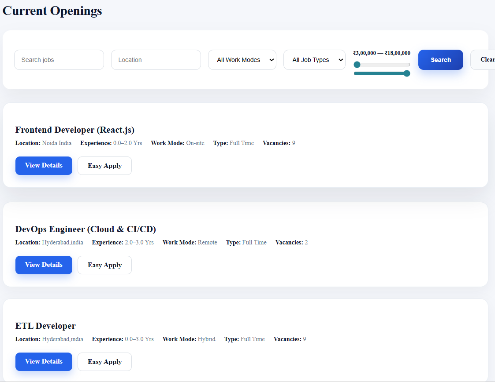
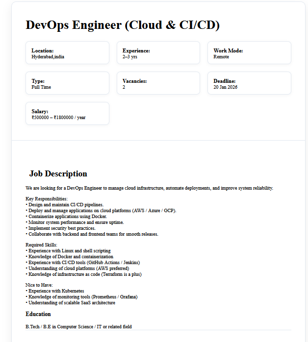
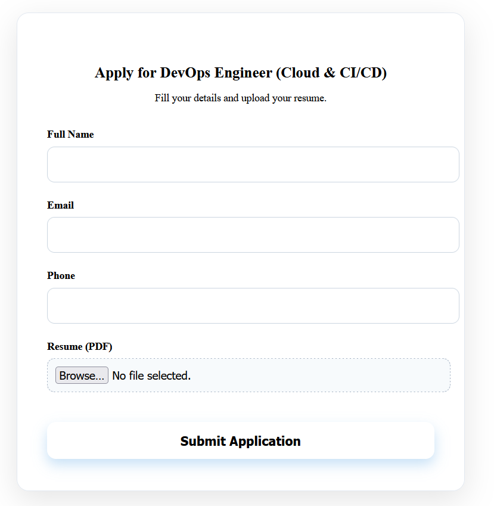
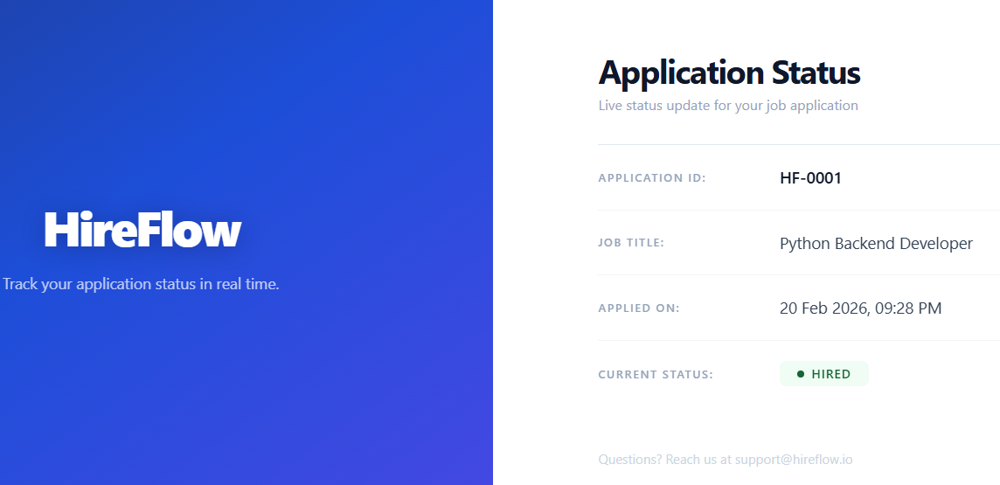
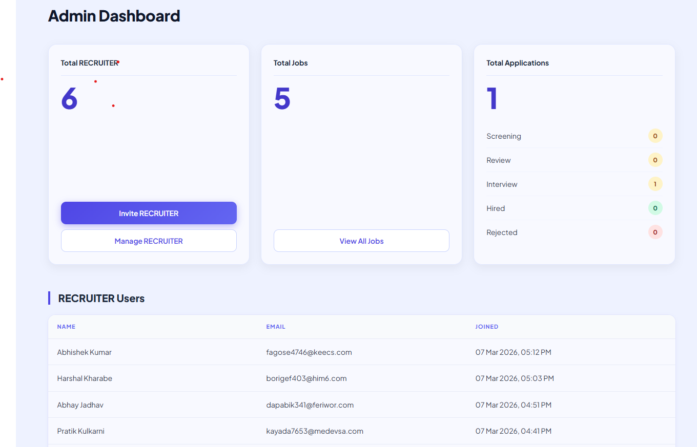
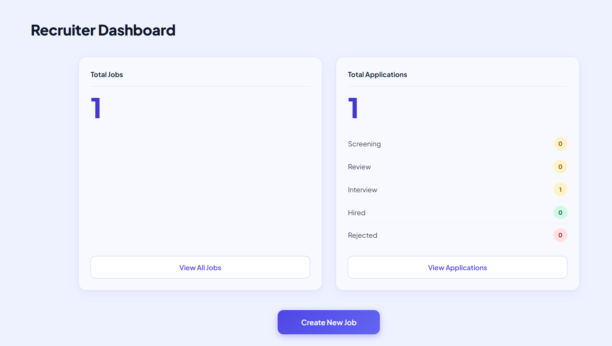
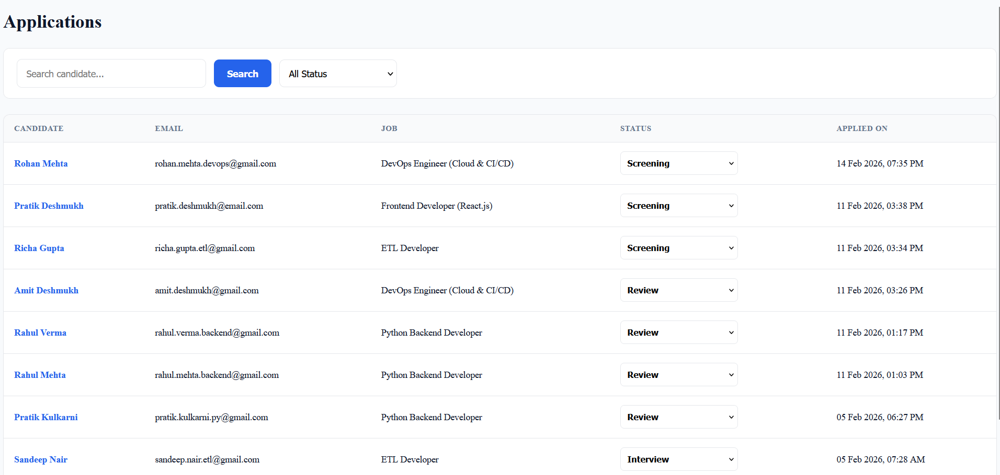
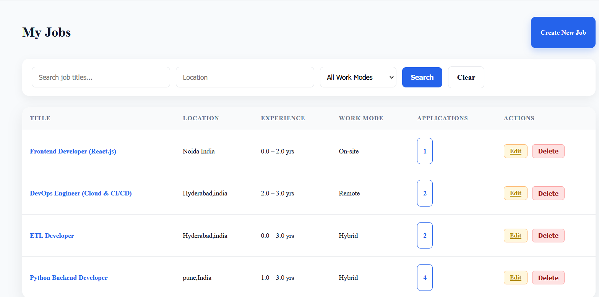
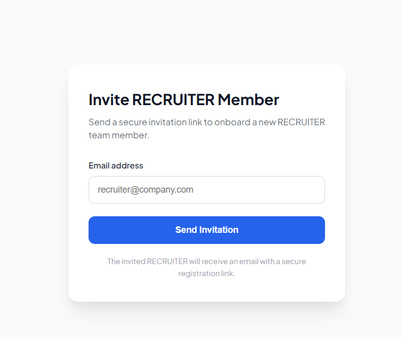
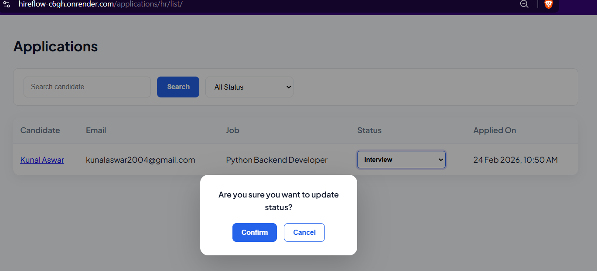

# 🚀 HireFlow – Production-Ready Internal Hiring Management System


HireFlow is a **production-grade internal recruitment platform** built to simulate how real organizations manage hiring workflows securely within a single company.

It demonstrates:

- Strict Role-Based Access Control (RBAC) 
- Invite-only recruiter onboarding   
- Manual hiring pipeline management
- Enterprise-style dashboard architecture
- Token-based authentication & secure API layer
- Production deployment using PostgreSQL + Render

Unlike AI-driven ATS platforms, HireFlow intentionally focuses on **human-driven evaluation workflows**, mirroring real enterprise hiring environments where decisions remain structured, explicit, and controlled.

> ⚠️ Scope Note: HireFlow is a single-tenant internal system.  
> Multi-company SaaS support is intentionally excluded to maintain architectural clarity and production realism.

---

## 🌐 LIVE LINK

👉 https://hireflow-c6gh.onrender.com 

---

## 📸 UI Screenshots (Dashboard & Workflows)

### ⭐ Public Jobs List


### 📝 Job Detail Page


### 📤 Apply Form


### 📤 Email Update Status


### 🧑‍💼 Admin Dashboard


### 🧑‍💼 RECRUITER Dashboard


### 📊 Applications List


### 🛠️ RECRUITER Jobs List


### 📨 RECRUITER Invitation Management
  

###  RECRUITER Update Status


---

## 🔐 Demo Login Credentials (Local)

### **Admin**
```
Email:kunalaswar2004@gmail.com
Password: admin@12345
```

### **RECRUITER Recruiter**
```
Email: doviy53803@pckage.com
Password: recruiter@123   
```
---

## 🏗 System Workflow

- **Superadmin** → Creates Admin (via Django Admin)  
- **Admin** → Invites recruiter (secure token-based onboarding)  
- **Recruiter** → Creates jobs, reviews applicants, updates status  
- **Candidates** → Apply without accounts  

---
### ✔ Application Management

- Unified applications table  
- Resume preview & download  
- Inline status updates  
- Status-based filtering  
- Automatic dashboard synchronization  

---

### ✔ Unique Application ID System

Every candidate application is assigned a structured, professional reference ID.

Example:
HF-0001  
HF-0002  

Why this matters:

- Prevents exposure of internal database IDs  
- Enables secure public tracking without authentication  
- Provides clean reference format for recruiter communication  
- Mirrors how real enterprise hiring systems manage candidate references  

This improves system security, professionalism, and workflow clarity.

---

## 🎯 Key Features

### ✔ **Public Job Portal**

- Browse and filter available jobs  
- View detailed job descriptions  
- Apply without creating an account  
- PDF resume upload with validation  
- Duplicate application prevention  

---

### ✔ **Manual Hiring Pipeline**

Structured status workflow:


Screening → Review → Interview → Hired / Rejected

- Recruiter updates candidate status manually  
- Inline dropdown-based status management  
- Real-time dashboard count updates  
- Fully human-driven evaluation (no automation / no AI scoring)  

---

### ✔ **Role-Based Access Control (RBAC)**

| Role | Key Capabilities | Restrictions |
|------|------------------|-------------|
| **Superadmin** | Full system control (Django Admin) | Not part of hiring workflow |
| **Admin** | Invite/manage recruiter, view jobs & applications | Cannot create or edit jobs |
| **Recruiter** | Create/edit/delete jobs, review applications | Cannot invite recruiter |
| **Candidate** | Apply to jobs | No login required |

---

### ✔ **Secure Recruiter Invitation System**

- UUID-based signup tokens  
- Token expiration support  
- Invite-only recruiter onboarding  
- Prevents unauthorized recruiter registration  
- Email delivery via **Brevo Email API**  
- Render-compatible deployment support  

---

### ✔ **Enterprise Dashboards**

#### Admin Dashboard
- Total recruiter users  
- Total jobs  
- Total applications  
- Hiring pipeline breakdown  
- Recruiter management interface  

#### RECRUITER Dashboard
- Jobs owned by recruiter  
- Application count  
- Quick access to My Jobs  
- Application management access  

---

### ✔ **Job Management**

- Create new jobs  
- Edit job details  
- Soft delete jobs  
- Search and filter support  
- View application count per job  

---

### ✔ **Application Management**

- Unified applications table  
- Resume preview & download  
- Inline status updates  
- Status-based filtering  
- Automatic dashboard synchronization  

---

## 🧑‍💻 REST API Endpoints (DRF + Token Authentication)

> APIs are structured to reflect internal service boundaries and support future frontend or microservice expansion.

### 🔐 Authentication
```
Authentication
POST /api/auth/login/ 
POST /api/auth/logout/
GET  /api/auth/me/
```
---
### 🌍 Public APIs
```
GET  /api/jobs/
GET  /api/jobs/<slug>/
POST /api/apply/<slug>/
```
---

### 👩‍💼 RECRUITER APIs
```
POST   /api/jobs/create/
PUT    /api/jobs/<id>/update/
DELETE /api/jobs/<id>/delete/

GET    /api/applications/
PATCH  /api/applications/<id>/status/
```
---

## 🛠️ Tech Stack


| Layer | Technology | Rationale |
|-------|------------|-----------|
| **Backend Framework** | Django 5.2 | Secure, scalable web framework with ORM, middleware, and built-in admin |
| **API Layer** | Django REST Framework 3.14 | Token-based authentication, serializers, and permission control |
| **Authentication** | DRF Token Authentication | Stateless API security with role-based access control |
| **Database (Production)** | PostgreSQL | ACID-compliant relational database for structured hiring data |
| **Database (Development)** | SQLite | Lightweight database for local development |
| **File Storage** | Supabase Object Storage | Persistent cloud storage for resumes (avoids Render ephemeral filesystem issues) |
| Email Service | Brevo HTTP API | Secure transactional emails for recruiter invites and application status update notifications |
| **Frontend Layer** | Django Templates + Bootstrap 5 | Server-rendered responsive UI architecture |
| **Static File Serving** | WhiteNoise | Efficient production-grade static asset serving |
| **Deployment Platform** | Render | Managed cloud hosting with automatic CI/CD deployments |


---

## 🔒 Security Highlights

- CSRF protection  
- Strict role-based permission enforcement  
- Token-based authentication  
- Secure recruiter invite workflow  
- Password validation rules  
- Soft delete pattern for data safety  
- Environment-based configuration (production vs development)  
- Secure session handling 
- Public-safe application tracking endpoint (no authentication required)
- Application ID abstraction (no raw database ID exposure)
- Email failure isolation (status updates succeed even if email fails) 

---

## 📂 Project Structure
```
HireFlow/
│
├── core/ # Settings, URLs, middleware
├── users/ # Custom user model + RECRUITER invite system
├── jobs/ # Job model + CRUD logic
├── applications/ # Application workflow & status management
├── api/ # REST API layer
│
├── templates/ # UI templates
├── static/ # CSS / JS assets
├── screenshots/ # README UI screenshots
│
├── manage.py
├── requirements.txt
└── README.md
```
---

## 🖥️ UI & Responsiveness (Supporting Layer)

The UI is intentionally kept structured and workflow-driven to **support backend logic** rather than showcase frontend frameworks.

- Server-rendered Django templates  
- Bootstrap 5 responsive layout  
- Sidebar-based navigation for dashboards  
- Clear separation between Admin and RECRUITER views  
- Mobile-friendly interface  

> The primary focus of this project is **backend architecture, RBAC enforcement, and structured hiring workflow simulation**.

## 📦 File Storage & Resume Handling

HireFlow stores resume files using **Supabase Storage (Object Storage)** instead of the application server filesystem.

---

### 🔎 Why Supabase Storage?

- Cloud platforms like **Render (Free Tier)** use ephemeral filesystems  
- Files stored locally are deleted on redeploy or restart  
- Supabase provides persistent, production-grade object storage  
- Clean integration with PostgreSQL-based backends  
- Designed for scalable, cloud-native file handling  

---

### ⚙️ How HireFlow Implements It

- Candidates upload resumes (**PDF only**)  
- The file is uploaded directly to a Supabase public bucket  
- Files are structured by job slug for logical separation  
- Django stores only the resume URL (`resume_url`) in PostgreSQL  
- RECRUITER can preview or download resumes securely  
- No resume files are stored on the application server  

---

### 🏗️ Architecture Separation

| Layer | Responsibility |
|-------|----------------|
| Django (Render) | Application logic + APIs |
| PostgreSQL | Structured data (users, jobs, applications) |
| Supabase Storage | Resume file persistence |

---

### 🚀 Benefits

- Persistent storage across deployments  
- Resume files survive redeploys  
- Clean separation of compute and storage  
- CDN-backed fast file access  
- Easily replaceable with AWS S3 / GCS in enterprise environments  

> This follows real-world production architecture where application servers do not store user-uploaded documents directly.

---

## ⚙️ Installation & Setup

### 1️⃣ Clone Repository

```bash
git clone https://github.com/kunalaswar/HireFlow.git
cd HireFlow
```

---

### 2️⃣ Create Virtual Environment

```bash
python -m venv env
```

Activate environment:

**Windows**
```bash
env\Scripts\activate
```

**macOS / Linux**
```bash
source env/bin/activate
```

---

### 3️⃣ Install Dependencies

```bash
pip install -r requirements.txt
```

---

### 4️⃣ Apply Migrations

```bash
python manage.py migrate
```

---

### 5️⃣ Run Development Server

```bash
python manage.py runserver
```

Visit:

👉 http://127.0.0.1:8000

---

### 4️⃣ Create `.env` File

Create a `.env` file in the root directory:

```env
SECRET_KEY=___________
DEBUG=True

DB_NAME=hireflow
DB_USER=postgres
DB_PASSWORD=__________
DB_HOST=127.0.0.1
DB_PORT=5432

BREVO_API_KEY=your-brevo-api-key
BREVO_SENDER_EMAIL=kunalaswar2004@gmail.com
BREVO_SENDER_NAME=HireFlow
```

---

### 5️⃣ Apply Migrations

```bash
python manage.py migrate
```

---

### 6️⃣ Start Development Server

```bash
python manage.py runserver
```

Visit:

👉 http://127.0.0.1:8000


## 💡 Testing the System
**Test Secure Invite Flow**: Log in as Admin → Invite RECRUITER → Use any email (or temporary mail) to receive the tokenized signup link.

This validates:

- Secure invite-based onboarding
- Role separation enforcement
- Job creation permissions
- Application submission workflow
- Status pipeline updates
- Automatic email notification delivery
- Public application tracking page validation
- Dashboard metric synchronization
---

## 👨‍💻 Developer

**Your Name**  
Backend Developer (Python • Django • REST APIs • PostgreSQL)

- 🌐 GitHub: https://github.com/kunalaswar/
- 💼 LinkedIn: https://www.linkedin.com/in/kunal-aswar-2550bb295/
- 📧 Email: kunalaswar2004@gmail.com 

---

## 🎯 Why I Built This Project

Most beginner backend projects stop at basic CRUD functionality.

I wanted to build something closer to how **real internal hiring systems operate**, where:

- not everyone can register freely
- roles must be strictly separated
- dashboards must reflect live workflow state
- recruiters must be onboarded securely
- production deployment constraints must be considered from day one

This project forced me to think about:

- RBAC boundary enforcement
- Invite-token lifecycle management
- Production database configuration (PostgreSQL)
- Environment-based settings architecture
- Dashboard-level data aggregation
- Secure status transition logic

HireFlow represents how I approach backend systems:

**structured first, explicit over implicit, secure by design.**

---

## 🏁 Conclusion

**HireFlow** is a complete enterprise-grade internal hiring platform demonstrating:

- ✅ Secure Role-Based Access Control (RBAC)
- ✅ Invite-only recruiter onboarding system
- ✅ Structured manual hiring pipeline
- ✅ Real-time dashboard aggregation logic   
- ✅ REST API layer with token authentication
- ✅ Production-ready Django architecture (PostgreSQL + Render deployment)
- ✅ Public application tracking system with unique IDs
- ✅ Automated status notification emails

